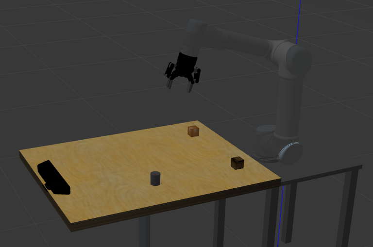
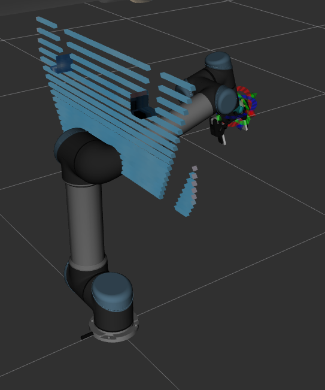

# VisionTrack

## Dependencies
- `universal_robot`
- `robotiq`

## Environment
- Ubuntu 20.04  
- ROS Noetic  
- Gazebo

## Usage

**1. Launch the Gazebo simulation** (Terminal A):
```bash
roslaunch ur5_gazebo ur5_gripper_sim.launch
```


**2. Launch the MoveIt simulation** (Terminal B):
```bash
roslaunch ur5_gripper_moveit ur5_moveit_planning_execution.launch
```


> The simulation includes UR5 manipulator, Robotiq gripper, and a reachable RGB-D camera.

## Features Implemented
- Modified URDFs to combine UR5 and Robotiq gripper for both description and Gazebo
- MoveIt configuration for UR5 with gripper
- Gazebo environment setup
- Basic motion control:
  - Robot state read/write
  - Gripper open/close
- 2D pixel to 3D world pose transformation for building blocks

## To Do
- Train YOLO prediction model
- Predict grasp points and execute grasp control
- Implement reinforcement learning-based planning
